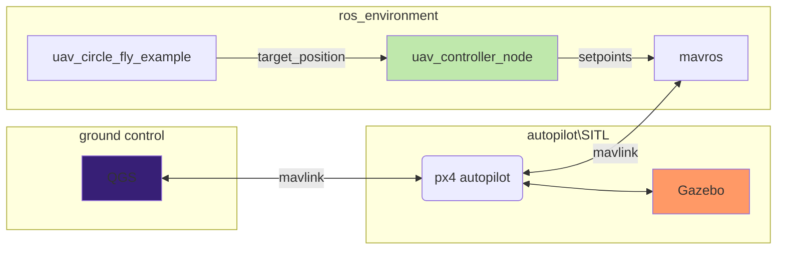

# Инструкция по выполнению Модуля 5

## Введение

В модуле 5 вы познакомитесь с работой с ROS,
симулятором gazebo и автопилотом PX4.

В рамках данного задания вам требуется разработать модуль который позволит управлять летательным 
аппаратом через простую систему команд, для полета по заданному маршруту.

**Обращаем внимание**, данный модуль очень важен и будет использоваться во всех остальных заданиях по курсу. Прежде чем переходить к выполнению задания рекомендуется ознакомиться с материалом по [ссылке](docs/ros_cookbook.md),
он поможет вам лучше разобраться в деталях работы ROS
и освоить базовые основы разработки на небольших примерах.

При желании разобраться с docker предлагается ознакомиться с [инструкцией по использованию](docs/docker_usage.md).

---

При использовании контейнеров docker можно использовать любой дистрибутив Linux для выплнения за не обязательно использовать Ubuntu 20.04

---

### Установка зависимостей:

При нативном запуске симуляции(если не используется контейнер) необходимо выполнить следующие инструкции.

Загрузка репозитория автопилота PX4:

```bash
git clone https://github.com/PX4/PX4-Autopilot.git --recursive && cd PX4-Autopilot
```

Инициализация:
```bash
git checkout v1.13.3 && git submodule update --init --recursive 
```

Установка зависимостей:
```bash
sudo chmod +x Tools/setup/ubuntu.sh
./Tools/setup/ubuntu.sh
```
Выполним сборку:
```bash
DONT_RUN=1 make px4_sitl_default gazebo -j$(nproc)
```

Установим пакет для взаимодействия автопилота через и компьютера, **mavros**. Этот пакет является связующим звеном между автопилотом и нашей системой. **Mavros** транслирует mavlink сообщения в ROS топики и в обратном порядке. Таким образом мы подключаем автопилот к экосистеме ROS.

```bash

sudo apt-get install ros-noetic-mavros -y

sudo apt-get install ros-noetic-mavros-extras -y

wget https://raw.githubusercontent.com/mavlink/mavros/master/mavros/scripts/install_geographiclib_datasets.sh

bash ./install_geographiclib_datasets.sh -y

rm install_geographiclib_datasets.sh
```

---

### Далее добавьте инициализацию окружения для PX4 в ~/.bashrc файл
```bash
# Инициализация окружения ROS
source /opt/ros/noetic/setup.bash

# Инициализация локального окружения ROS из вашего рабочего пространства
source /home/$USER/catkin_ws/devel/setup.bash

# Инициализация окружения для автопилота PX4
source /home/$USER/your_path/PX4-Autopilot/Tools/setup_gazebo.bash /home/$USER/your_path/PX4-Autopilot /home/$USER/your_path/PX4-Autopilot/build/px4_sitl_default

export ROS_PACKAGE_PATH=/opt/ros/noetic/share:/home/$USER/your_path/PX4-Autopilot:/home/$USER/your_path/PX4-Autopilot/Tools/sitl_gazebo

```
**your_path** - обозначение вашего пути до папки.

---

### После установки зависимостей вы сможете выполнять запуск симулятора 
Команда запуска:

```bash
roslaunch px4 mavros_posix_sitl.launch
```

### В результате должен будет запуститься симулятор gazebo с аппаратом.

<p align="center">
    <strong>Источник: </strong> Михаил Колодочка
</p>

---

### Краткий гайд по сборке пакетов с использованием ros

- Необходимо выполнить подготовку окружения для ваших пакетов.
- Создайте папку для ваших пакетов
    ```bash
  mkdir -p catkin_ws/src
  ```
- Проинициализируйте окружение из папки src
  ```bash 
  cd src && catkin_init_workspace 
  ```
- Теперь создайте пакет коммандой
  ```bash
  catkin_create_pkg <pkg_name>  
  ```
  или в случае 5 задания скачайте подготовленный пакет в src из архива в задании

- Потом выполните сборку пакета изи папки catkin_ws при помощи команды:

  ```bash
  catkin_make
  ```
  Или с использованием более современной системы для сборки:

  ```bash
  catkin build
  ```

  -Выполните экспорт пакетов
  
  ```bash
  source <ваш_путь_к_папке_catkin_ws>/catkin_ws/devel/setup.bash
  ```
  Примечание
  Для того чтобы каждый раз не вводить вышеуказанную команду добавьте ее в конец файла ~/.bashrc( ~/ это путь к домашней папке, символ точка(.) означает что файл скрытый).
  Для того чтобы открыть файл можно воспользоваться текстовым редактором gedit или любым другим. Например:
  gedit ~/.bashrc

Файл **~/.bashrc** выполняется всякий раз когда вы открываете терминал. То есть теперь все переменные и названия папок, объявленные в setup.bash  теперь будут в терминале(это получается за счет использования команды source,  которая в отличии от простого выполнения скрипта через символы ./
не стирает переменные после выполнения скрипта, а оставляет их в вашем окружении откуда был запущен скрипт, то есть в нашем случае в каждом новом терминале)


### Запуск примера

После сборки пакета выполните команду:

```bash
rosrun uav_controller go_to_example
```

В данном случае запускается данный [пример](examples/simple_flight_example.cpp).

Предварительно проверьте что симулятор был запущен.

После запуска программа появиться в списке зарегистрированных в мастер ноде.

Для того чтобы это проверить введите команду:

```bash
rostopic list
```

Для запуска разрабатываемой программы выполните команду
или воспользуйтесь отладчиком среды разработки.

```bash
rosrun uav_controller uav_controller_node
```

---

Для работы требуется включить настройку virtual_joystck в QgrounControl для имитации подключения реальной аппаратуры управления. Иначе аппарат не будет переходить в состояние **ARM**.


---
### Выполнение домашнего задания

Программа(Нода) **uav_circle_fly_example** Отправляет в топик **/vehicle/desPose**, координаты с целевым положением БЛА.

Ваша задача разработать программное обеспечение осуществляющее плавное следование аппарата по заданной траектории(окружность).

Предлагается заполнить недостающие поля в файле [src/uav_controller.cpp](src/uav_controller.cpp) и [src/uav_controller.cpp](src/uav_controller.cpp). Перед работой ознакомиться с примерами в папке **examples**.

Работу можно представить в виде следующей блок схемы, где зеленым цветом обозначена разрабатываемая программа:



Что такое mavros можно узнать [тут](docs/mavros.md).

Требования:
1) Программа должна принимать сообщения из топика **/vehicle/desPose**.

2) Согласно принятым сообщениям, на основе П регулятора программа должна формировать вектор целевой скорости БЛА.

3) Вектор целевой скорости БЛА программа должна отправлять в топик **/mavros/setpoint_raw/local** в формате сообщения **mavros_msgs/PositionTarget**.

---
### Проверка результатов
1) Выполните запуск симулятора.
2) В папке build запустите программу **./uav_circle_fly_example**
3) Программа начнет отправлять вам координаты с целевым положением в топик **/vehicle/desPose**
4) Запустите вашу программу, например **./uav_controller_node**
5) Если аппарат движется плавно по окружности, то задание можно считать выполненным.


