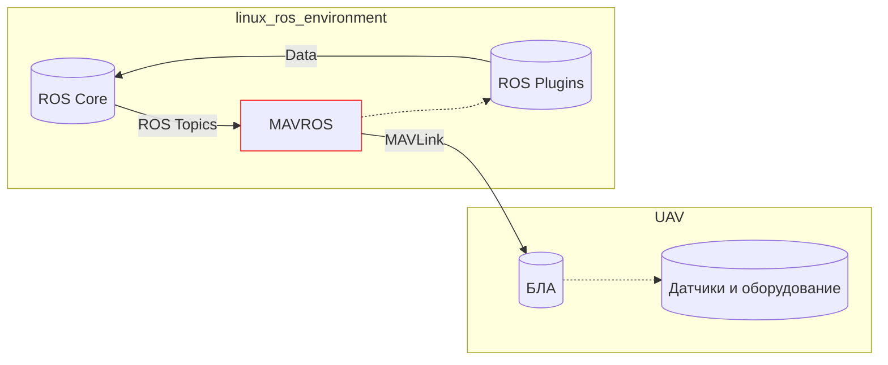

# Mavros

**MAVROS** — это программное обеспечение(ROS пакет), представляющий собой адаптер между средой ROS и протоколом MAVLink, который используется для общения с различными беспилотными аппаратами (БЛА). 

**Mavlink** — это легковесный протокол сообщений для связи между беспилотными авиационными системами и наземными станциями управления или между различными компонентами на борту БЛА. Этот протокол широко используется в таких системах, как дроны и другие типы беспилотных аппаратов.
    
Протокол **MAVLink** широко поддерживается многими программными пакетами для управления БЛА и интеграции различных систем, делая его де-факто стандартом в индустрии беспилотных летательных аппаратов.

**Mavros** позволяет пользователям ROS легко интегрировать управление БЛА в свои проекты, обеспечивая обширный набор инструментов для мониторинга и управления полетами в реальном времени. Mavros это своего рода драйвер для соединения БЛА с экосистемой ROS. Данный пакет пользуется широкой популярностью в индустрии и работает с основными открытыми автопилотами Px4 и Ardupilot.

Основные возможности MAVROS:
- **Получение телеметрии**: MAVROS позволяет получать данные о положении, скорости, ориентации и многих других параметрах беспилотника в реальном времени.

- **Управление полетом**: Через MAVROS можно отправлять команды на взлет, посадку, а также управлять полетными режимами и маршрутами.

- **Взаимодействие с оборудованием**: MAVROS может управлять камерами, датчиками и другим подключенным к БЛА оборудованием.

Эта схема показывает, как MAVROS соединяет ROS с БЛА, обмениваясь данными через протокол MAVLink.