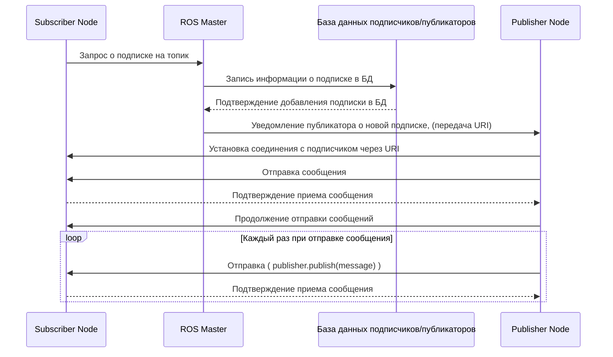

# Основы использования ROS

<p align="center">
    <strong>Источник: </strong> https://en.m.wikipedia.org/wiki/File:Ros_logo.svg
</p>


Этот материал будет полезен тем, кто ещё не знаком с ROS. Вы рассмотрите основные принципы работы этого фреймворка и научитесь создавать программы на языках **C++** и **Python** с его использованием.

# Оглавление

<!-- TOC -->
* [Основы использования ROS](#основы-использования-ros)
* [Введение](#введение)
  * [Что мы знаем о ROS](#что-мы-знаем-о-ros)
    * [Зачем нам ROS](#зачем-нам-ros)
  * [Термины и определения](#термины-и-определения)
    * [Примечание](#примечание)
* [Первые шаги](#первые-шаги)
  * [Создание окружения](#создание-окружения)
  * [Создание проекта](#создание-проекта)
  * [Программа издатель](#программа-издатель)
    * [Пример на языке Python](#пример-на-языке-python)
    * [Пример на языке C++](#пример-на-языке-c)
  * [Установка пакета](#установка-пакета)
  * [Запуск примера](#запуск-примера)
  * [Программа подписчик](#программа-подписчик)
    * [Пример на языке python](#пример-на-языке-python-1)
    * [Пример на языке C++](#пример-на-языке-c-1)
    * [Запуск примеров](#запуск-примеров)
  * [roslaunch](#roslaunch)
* [Сервисы(Services)](#сервисыservices)
  * [Пример на языке python](#пример-на-языке-python-2)
  * [Пример на языке C++](#пример-на-языке-c-2)
  * [Запуск примера](#запуск-примера-1)
    * [Примечание](#примечание-1)
  * [Первый проект на ROS](#первый-проект-на-ros)
* [Выводы](#выводы)
<!-- TOC -->

---

# Введение

ROS (Robot Operating System) — гибкий фреймворк для разработки программного обеспечения (ПО) робототехнических систем. **Это не операционная система** в классическом понимании, а набор инструментов, библиотек и соглашений, которые облегчают разработку робототехнических систем. ROS создан, чтобы обеспечить масштабируемость и возможность совместного использования кода между роботами и платформами.


## Что мы знаем о ROS

Вы посмотрели видео и, скорее всего, уже знаете, зачем нужен ROS и с какой целью он используется. Тем не менее повторим основную информацию.

###  Зачем нам ROS

Представим ситуацию: нам необходимо сделать робота 🤖🤖🤖🤖🤖 для мониторинга склада при помощи голосового управления. Чтобы он мог правильно перемещаться, необходимо сделать ему систему навигации (локализации). Понадобится система предотвращения столкновений, чтобы робот не врезался в окружающие объекты. Для движения по маршруту нужна система управления, а для контроля робота — система голосового управления.

В итоге нужно сделать четыре системы:

1) навигационную;
2) управления роботом;
3) предотвращения столкновений;
4) голосового управления.

Если попытаться сделать это в одной программе, то, вероятнее всего, мы столкнёмся с кучей ошибок, перекрёстных связей, проблем с использованием нескольких потоков. При масштабировании проекта или внесении изменений в одну из его частей почти гарантированно всплывут новые проблемы, на решение которых может уйти немало времени.


Первое, что может прийти в голову, — это идея делать системы в отдельных программах, каждая из которых будет работать независимо. У этого решения есть свои преимущества:


* **Масштабируемость.** Разделение системы на модули позволяет независимо разрабатывать, тестировать и оптимизировать каждую составляющую. Это облегчает добавление или изменение функциональности в будущем.

* **Повторное использование.** Модульная архитектура позволяет повторно использовать код и алгоритмы для разных проектов, что сокращает время разработки и снижает затраты на создание новых систем.


* **Отказоустойчивость.** Если одна из подсистем выйдет из строя, остальные модули продолжат работать. Это обеспечивает отказоустойчивость системы и упрощает процесс отладки и исправления ошибок.


* **Совместимость.** Разделение на модули облегчает интеграцию с другими системами, например системами управления складом или голосовыми ассистентами.

Следующий вопрос после разделения систем на программные модули — взаимосвязь между ними. Можно воспользоваться передачей данных через UDP/TCP, но тогда придётся разрабатывать клиент-серверную часть, структуры сообщений и прочее.


Даже если решить проблемы с коммуникацией, возникают вопросы логирования информации при передаче сообщений и работе программ, хранения настроек и параметров системы. Ещё пригодились бы средства для имитационного моделирования и визуализации работы робота.


Чтобы решить эти задачи, нужен инструмент для организации системы связи между программами, сервер для хранения настроек, система логирования, симулятор и средства визуализации.

Все вышеописанные инструменты включает в себя фреймворк ROS. Это регулярно обновляемый opensource-проект, вокруг которого сформировано большое сообщество. ROS содержит утилиты, пакеты, драйверы для оборудования, алгоритмы для навигации, управления, построения карт и так далее.

Иными словами, используя пакеты уже готовых модулей, можно избавить себя от необходимости в их разработке.

## Термины и определения

Рассмотрим основные определения, с которыми вы столкнётесь при изучении ROS, а потом на практике детально рассмотрим их значение.


**Nodes (узлы), или ноды**, играют центральную роль в организации и выполнении вычислительных задач в робототехнической системе. У нод конкретные функции: обработка данных, вычисления, обмен сообщениями. Нода в системе должна иметь уникальное имя, которое идентифицирует её в контексте ROS.


Каждая нода в ROS — это отдельный процесс, который может быть запущен на отдельном компьютере или на одной машине. Ноды общаются друг с другом через механизм публикации-подписки (Publish/Subscribe) и запроса-ответа (Service/Action) с использованием топиков и сервисов.

То есть при разработке ПО для роботов и дронов мы будем создавать именно nodes, определяя для каждой функциональность и логику. Разработку под ROS в основном ведут с использованием языков программирования **C++** и **Python**. Из-за непопулярности разработки на других языках практически полностью отсутствует документация, хотя, например, есть возможность работать с **ROS** на **С#** и **Java**.


`Master(Мастер)` — центральная нода, отвечающая за управление системой ROS. Мастер предоставляет реестр имён (name registry), где ноды могут объявлять своё имя и находить другие в системе. Он также координирует коммуникацию между нодами, позволяя им обмениваться сообщениями и находиться в сети ROS. Все ноды в системе должны быть зарегистрированы в мастере.

Именно поэтому перед стартом всех nodes мы запускаем **roscore**, то есть master-node, который как раз будет связывать nodes между собой.


`Message(сообщение)` — структурированный тип данных, который используется для обмена информацией между нодами. Сообщения определяют формат и содержание данных, которые могут быть отправлены и приняты нодой через топики или службы. Описываются в виде файлов .msg, где указываются поля и их типы данных.


`Topic(топик)` — именованный канал, через который nodes публикуют и подписываются на сообщения. Представляет особый тип сообщения, который определяет структуру данных, передаваемых через топик. Nodes могут публиковать сообщения на топик и подписываться на него для получения сообщений. Как это происходит на практике, показано в примерах ниже.


Помимо топиков с сообщениями, существуют и другие способы взаимодействия между nodes, такие как **Services и Actions**. Но мы рассмотрим только **Services (сервисы)**, так как Actions используются, как правило, намного реже.

`Service (сервис)` — способ взаимодействия между nodes для выполнения запросов и получения ответов. Сервисы предоставляют механизм вызова удалённых процедур (remote procedure call, RPC) между узлами ROS.

Вместо того чтобы просто публиковать сообщения на топики (как в случае с публикацией-подпиской), сервисы позволяют нодам запрашивать выполнение определённых операций или получать конкретные данные от других нод.


Когда node-client отправляет такой запрос, нода блокируется и ожидает ответа от сервера, который предоставляет доступ к данному сервису. Сервер обрабатывает запрос и отправляет ответ обратно на node-client. После получения ответа нода может продолжить свою работу.

Сервисы особенно полезны, когда требуется выполнение сложных операций или получение данных, которые не являются непрерывными потоками, а представляют собой конкретные результаты или информацию. Например, нода может запросить у других нод информацию о конфигурации, отправить команду на выполнение определённого действия или запросить данные с датчика.

Использование сервисов позволяет nodes эффективно взаимодействовать и передавать данные в виде запросов и ответов, что способствует гибкости и модульности системы ROS.


### Примечание

Ознакомиться с основными командами терминала для ros можно по [ссылке](ros_base_commands.md),
также рекомендуется повторить базовые команды терминала [linux](linux_base_commands.md). 

---

# Первые шаги

Вы уже установили инструменты для работы и запустили пример с черепахой 🐢🐢🐢 Теперь подробнее разберёмся с командами и разработкой ПО с использованием ROS.

## Создание окружения

Выполним инициализацию рабочего пространства для ROS.

Создадим папки рабочего пространства (catkin_ws) и папку для исходного кода наших будущих проектов (src). Для этого введём в терминал следующие команды:


```bash
mkdir -p catkin_ws/src && cd catkin_ws
```

## Создание проекта

Перейдем в папку, где будут храниться исходники проекта

```bash
cd src 
```


```bash
catkin_create_pkg my_first_project rospy
```

Команда `catkin_create_pkg` используется для создания нового пакета в рабочей директории catkin. **Пакет в ROS** — это базовая единица организации ПО, которая включает в себя код, конфигурационные файлы, зависимости и другие ресурсы.

Когда вы выполняете команду **catkin_create_pkg**, создаётся новая директория с именем пакета в директории 'src' вашей рабочей директории catkin. В этой новой директории создаются несколько файлов и директорий, например CMakeLists.txt и package.xml, которые определяют структуру и зависимости пакета.

Перейдем в папку с нашим созданным пакетом.

```bash
cd my_first_project 
```

В папке проекта мы видим следующие объекты
* `CMakeLists.txt`  — файл с инструкциями для системы сборки CMake, который определяет, как собирать пакет, устанавливать исполняемые файлы, настраивать зависимости и так далее.

* `package.xml`  — файл с метаданными пакета, который содержит информацию о пакете, такую как имя, версия, авторы, лицензия, зависимости и так далее.

* `src` — директория исходного кода.


Мы не будем изучать CMake подробно, но познакомимся с её использованием.


`CMake`  — кросс-платформенная система автоматической сборки ПО, которая позволяет разработчикам описывать процесс сборки программного проекта в унифицированном формате, независимом от конкретной операционной системы и компилятора. **CMakeLists.txt** используется для сборки пакетов — основных единиц организации кода в ROS. Пакет в ROS — это директория, содержащая исполняемые файлы, библиотеки, скрипты, конфигурационные файлы и другие ресурсы, связанные с определённым функционалом или модулем.


`CMakeLists.txt` в пакете ROS определяет зависимости пакета, исходные файлы, библиотеки, исполняемые файлы и другие компоненты, которые должны быть скомпилированы и связаны для сборки пакета. Он также может содержать дополнительные инструкции, такие как настройки компилятора, определение макросов и настройки переменных окружения.


Во время сборки проекта catkin анализирует файлы **package.xml** всех пакетов в рабочей директории и определяет порядок сборки на основе их зависимостей. Это гарантирует, что пакеты собираются в правильном порядке и все зависимости удовлетворены.


Перед тем как продолжить дальше, предлагается заполнить метаданные пакета `package.xml`
По аналогии с примером `package.xml` в папке проекта **my_first_project**.

```xml
<package format="2">
  <name>my_first_project</name>
  <version>1.2.4</version>
  <description>
    This package provides foo capability.
  </description>
  <maintainer email="name.surname@domain.com">Name Surname</maintainer>
  <license>BSD</license>

  <buildtool_depend>catkin</buildtool_depend>
</package>

```

## Программа издатель

Напишем нашу первую программу (node/узел), которая будет присылать простое текстовое сообщение. Ниже будут приведены примеры кода для С++ и Python, а также варианты заполнения CMakeLists.txt.

### Пример на языке Python

Для начала добавим файл для нашего скрипта. Для этого создадим папку **scripts** в директории нашего проекта.


```bash
mkdir scripts && cd scripts
``` 

```bash
touch talker.py # создадим файл программы
```

Скрипт содержит следующий код:

```python
#!/usr/bin/env python3
# подключаем библиотеки
import rospy
from std_msgs.msg import String

# Обьявляем класс
class TalkerNode(object):
    # обьявляем конструктор класса
    def __init__(self): 
        # Создаем новый узел с именем 'talker' и указываем, что он является анонимным
        rospy.init_node('talker', anonymous=True)
        
        # Создаем новый паблишер на тему 'chatter' с типом сообщения 'std_msgs/String'
        self.publisher = rospy.Publisher('chatter', String, queue_size=10)

        # Устанавливаем частоту публикации сообщений в 10 Гц
        self.rate = rospy.Rate(10)

    def run(self):
        while not rospy.is_shutdown():
            # Генерируем новое сообщение
            hello_str = "hello world %s" % rospy.get_time()

            # Выводим информацию о новом сообщении в логи
            rospy.loginfo(hello_str)

            # Публикуем новое сообщение на тему 'chatter'
            self.publisher.publish(hello_str)

            # Ожидаем необходимый интервал времени перед публикацией следующего сообщения
            self.rate.sleep()

if __name__ == '__main__': 
    try:
        node = TalkerNode()
        node.run()
    except rospy.ROSInterruptException:
        pass
```

После того как мы создали скрипт требуется добавить его в файл конфигурации `CMakeLists.txt`:

```cmake
# Указываем минимальную версию CMake
cmake_minimum_required(VERSION 2.8.3)

# Указываем имя пакета ROS
project(my_first_project)

# Находим и подключаем необходимые пакеты ROS
find_package(catkin REQUIRED COMPONENTS
        rospy       # Пакет для работы с ROS на Python
        std_msgs    # Стандартные сообщения ROS
        )

# Объявляем зависимости пакета ROS
catkin_package()

# Включаем необходимые директории
include_directories(
        ${catkin_INCLUDE_DIRS}
)

# Устанавливаем исполняемый файл
install(PROGRAMS
        scripts/talker.py
        DESTINATION ${CATKIN_PACKAGE_BIN_DESTINATION}
        )

# Устанавливаем Python-скрипт как исполняемый файл
catkin_install_python(PROGRAMS
        scripts/talker.py
        DESTINATION ${CATKIN_PACKAGE_BIN_DESTINATION}
        )
```

### Пример на языке C++

Создадим файл для программы в папке src 

```bash
mkdir src && cd src
``` 

```bash
touch talker_node.cpp # создадим файл программы
```

Далее заполним программу и заменим CMakefile.txt, на указанный ниже.

```c++
#include <ros/ros.h>
#include <std_msgs/String.h>

class TalkerNode {
public:
  TalkerNode() {
    // Создаем новый узел
    ros::NodeHandle nh;

    // Создаем новый паблишер на тему 'chatter' с типом сообщения 'std_msgs/String'
    publisher = nh.advertise<std_msgs::String>("chatter", 10);
  }

  void run() {
    // Устанавливаем частоту публикации сообщений в 10 Гц
    ros::Rate rate(10);
    while (ros::ok()) {
      // Генерируем новое сообщение
      std_msgs::String msg;
      msg.data = "hello world " + std::to_string(ros::Time::now().toSec());

      // Выводим информацию о новом сообщении в логи
      ROS_INFO("%s", msg.data.c_str());

      // Публикуем новое сообщение на тему 'chatter'
      publisher.publish(msg);

      // Ожидаем необходимый интервал времени перед публикацией следующего сообщения
      rate.sleep();
    }
  }

private:
  ros::Publisher publisher;
  // ros::Rate rate;
};

int main(int argc, char **argv) {
  // Инициализируем новый узел ROS с именем 'talker'
  ros::init(argc, argv, "talker");

  // Создаем экземпляр класса TalkerNode и запускаем его
  TalkerNode node;
  node.run();

  return 0;
}
```

```cmake
# Указываем минимальную версию CMake
cmake_minimum_required(VERSION 2.8.3)

# Указываем имя пакета ROS
project(my_first_project)

# Находим и подключаем необходимые пакеты ROS
find_package(catkin REQUIRED COMPONENTS
        roscpp
        std_msgs
        )

# Объявляем зависимости пакета ROS
catkin_package()

# Включаем необходимые директории
include_directories(
        ${catkin_INCLUDE_DIRS}
)

# Создаем исполняемый файл
add_executable(talker_node src/talker_node.cpp)

# Линкуем необходимые библиотеки
target_link_libraries(talker_node ${catkin_LIBRARIES})

# Устанавливаем исполняемый файл
install(TARGETS talker_node
        RUNTIME DESTINATION ${CATKIN_PACKAGE_BIN_DESTINATION}
        )
```

## Установка пакета

После создания пакета и написания программ необходимо выполнить установку пакета. Для этого перейдём в папку **рабочего пространства**:

```bash
cd <your_path>/catkin_ws
```

Установим пакет для сборки catkin проектов:

```
sudo apt-get install python3-catkin-tools -y
```

Для сборки выполним команду:
```bash
catkin build
```

В случае успеха завершение команды выглядит следующим образом:


<p align="center">
    <strong>Здесь и далее источник: </strong> Михаил Колодочка
</p>


## Запуск примера

Для запуска пакета воспользуемся командой `rosrun`
```bash
rosrun <package_name> <node_name>
```

Но перед запуском программы требуется выполнить скрипт `setup.bash`,
который устанавливает необходимые переменные окружения и пути
для работы с ROS в текущем терминале. Для наших пакетов данный
файл лежит в папке `<your_path>/catkin_ws/devel`

Для экспорта выполним команду:
```bash
source <your_path>/catkin_ws/devel/setup.bash
```

Для того чтобы не выполнять команду каждый раз при запуске терминала
можно добавить ее в `.bashrc` файл.


Для вышесозданной программы команда запуска будет выглядеть следующим
образом:


```bash
rosrun my_first_project talker.py
```

для примера на c++:
```bash
rosrun my_first_project talker_node
```


В результате выполнения получим следующий вывод в терминале:


Откроем другое окно терминала и проверим работу программы,
с помощью команды:

```bash
rosnode list
```
В результате получим следующее:


Видим список всех ros Node.
В данном примере запущен симулятор **gazebo** и нода **mavros**,
однако обращаем внимание на работу **talker**, если данная нода есть в списке,
это означает что она активна в данный момент.

**rosout**  — специальный узел в ROS, который обрабатывает и публикует сообщения системного логгера (rosout). Этот узел отвечает за запись и отображение сообщений различных уровней важности, которые генерируются другими узлами в системе ROS. Когда другие узлы публикуют сообщения через системный логгер (rosout), например, с использованием функции `rospy.loginfo()` или `rospy.logger()`, эти сообщения могут быть перенаправлены в топик **/rosout**. Узел **/rosout** обрабатывает их и публикует в топик **/rosout**.


Теперь рассмотрим сообщение публикуемой программой talker. Для просмотра всех Topic в системе воспользуйтесь командой:

```bash
rostopic list
```
В результате должен появиться топик /chatter, объявленный в программе


Для прослущивания содепжимого топика можно использовать команду

```bash
rostopic echo /chatter
```

Для проверки частоты публикации воспользуемся командой

```bash
rostopic hz /chatter
```

## Программа подписчик

Напишем программу для обработки сообщений из топика /chatter. Для этого вкратце познакомимся с механизмом подписки.


Механизм подписки в ros работает в три этапа: `регистрация подписки`,
`уведомление публикаторов` и `передача сообщений`.

`Регистрация подписки`: node, которая хочет получать сообщения, регистрирует свою подписку на определённую тему (topic) у ROS Master. Это делается с помощью вызова метода подписки в коде node. Например, в rospy это может выглядеть так:

```python
rospy.Subscriber("topic_name", MessageType, callback_function)
```
После выполнения этого метода node отправляет запрос на подписку ROS Master. При получении запроса ROS Master сохраняет информацию о подписке в базу данных. Эта база содержит информацию обо всех nodes, которые подписаны на различные topic.


Далее происходит процесс `уведомления публикаторов`. После сохранения информации о подписке ROS Master уведомляет все узлы, которые публикуют сообщения на эту тему, о новом подписчике. После получения уведомления от ROS Master, публикующий node, подтверждает, что готов отправлять сообщения новому подписчику. Затем Master отправляет подтверждение о том, что подписка была успешно зарегистрирована. Важно отметить, что ROS Master передаёт URI подписчика публикатору.

---
**Примечание**

**URI (Uniform Resource Identifier)** — строка символов, используемая для идентификации имени или ресурса в интернете. В контексте ROS URI обычно будет выглядеть примерно так:

```bash
http://hostname:port/
```
Например, если у вас есть узел ROS, работающий на машине с IP-адресом 192.168.1.100 и слушающий на порту 11311, то его URI будет выглядеть так:

```bash
http://192.168.1.100:11311/
```

Этот URI затем может быть использован другими узлами для установления соединения с этим узлом.

При передаче сообщений используются протоколы TCP либо UDP.

---

После получения всей информации от **Master Node** публикатор начинает передачу сообщений, используя при этом URI подписчика, чтобы установить с ним прямое соединение. Это соединение в дальнейшем используется для передачи сообщений подписчику.

Ниже приведена циклограмма работы механизма подписок:



---
**Примечание**

Обратите внимание, что при появлении публикатора раньше подписчика процесс регистрации будет выглядеть аналогично, только node-подписчик будет регистрироваться в БД и ждать регистрации публикатора.

Вот еще несколько важных нюансов:

- `Множественные публикаторы и подписчики`.  В системе ROS может существовать несколько публикаторов и подписчиков для одной и той же темы. Это позволяет создавать сложные сети узлов, которые могут обмениваться информацией между собой через общие темы.


- `Анонимные узлы`. В приведённом выше примере кода мы использовали параметр anonymous=True при инициализации узла. Это означает, что ROS автоматически добавит уникальный идентификатор к имени узла, чтобы обеспечить его уникальность в сети. Это полезно, когда вы хотите запустить несколько экземпляров одного и того же узла.


- `Типы сообщений`. ROS использует строго определённые типы сообщений для обмена данными между узлами. В приведённом выше примере мы использовали тип сообщения String из пакета std_msgs. ROS предоставляет множество стандартных типов сообщений для общих типов данных, но также можно определить новые уникальные типы, если вам нужны более специализированные данные.

---

Такой процесс соединения между программами (Nodes) обеспечивает эффективную и надёжную систему обмена сообщениями в ROS, поскольку соединение устанавливается напрямую между публикатором и подписчиком. ROS Master же выступает своего рода прослойкой для связи программ между собой. Необходимость использования Master Node связана с необходимостью связи программ напрямую друг с другом при отсутствии информации друг о друге. У программы может быть сколько угодно публикаторов и подписчиков. Адрес ROS Master известен заранее всем программам и задаётся переменной окружения `export ROS_MASTER_URI=http://new_hostname:new_port/` Изменение **ROS_MASTER_URI** нужно, чтобы связать несколько Nodes, запущенных на разных машинах в сети. Для большинства сценариев ничего менять не требуется, `ROS_MASTER_URI=http://localhost:11311/`


Рассмотрим примеры.

### Пример на языке python


Перейдем в папку пакета:
```bash
roscd my_first_project
```

Cоздадим файл `listener.py` в папке scripts

```bash
cd scripts && touch listener.py
```

Напишем код:

```python
import rospy
from std_msgs.msg import String

# Определение класса для подписчика
class MySubscriber:
    def __init__(self):
        # Инициализация подписчика с именем топика "chatter" и функцией обратного вызова
        self.sub = rospy.Subscriber("chatter", String, self.chatter_callback)

    # Функция обратного вызова, выполняющаяся при получении сообщения
    def chatter_callback(self, msg):
        # Вывод полученного сообщения
        rospy.loginfo("Получено сообщение: %s", msg.data)

if __name__ == '__main__':
    # Инициализация узла ROS
    rospy.init_node('subscriber_node')

    # Создание экземпляра класса подписчика
    subscriber = MySubscriber()

    # Обработка колбэков и ожидание сообщений
    rospy.spin()
```

Для установки пакета добавим новый файл в CMakeLists.txt,
например можно модифицировать cmake с программой публикатором:

```cmake
# Устанавливаем исполняемый файл
install(PROGRAMS
        scripts/talker.py
        scripts/listener.py
        DESTINATION ${CATKIN_PACKAGE_BIN_DESTINATION}
        )

# Устанавливаем Python-скрипт как исполняемый файл
catkin_install_python(PROGRAMS
        scripts/talker.py
        scripts/listener.py
        DESTINATION ${CATKIN_PACKAGE_BIN_DESTINATION}
        )
```

### Пример на языке C++

Перейдем в папку пакета:
```bash
roscd my_first_project
```

Cоздадим файл `listener.cpp` в папке src

```bash
cd src && touch listener_node.cpp
```

Напишем код:

```c++
#include "ros/ros.h"
#include "std_msgs/String.h"

// Определение класса для подписчика
class MySubscriber
{
public:
  MySubscriber() // Конструктор
  {
    // Инициализация подписчика с именем топика "chatter" и функцией обратного вызова
    sub_ = nh_.subscribe("chatter", 10, &MySubscriber::chatterCallback, this);
  }

  // Функция обратного вызова, выполняющаяся при получении сообщения
  void chatterCallback(const std_msgs::String::ConstPtr& msg)
  {
    // Вывод полученного сообщения
    ROS_INFO("Message received: %s", msg->data.c_str());
  }

private:
  ros::NodeHandle nh_;         // Объект управления узлом
  ros::Subscriber sub_;        // Объект подписчика
};

int main(int argc, char** argv)
{
  // Инициализация узла ROS
  ros::init(argc, argv, "subscriber_node");

  // Создание экземпляра класса подписчика
  MySubscriber subscriber;

  // Обработка функций обратного вызова и ожидание сообщений
  ros::spin();

  return 0;
}

```

Добавим нашу программу в CMakeLists.txt

```cmake
# Создаем исполняемый файл
add_executable(talker_node src/talker_node.cpp)
add_executable(listener_node src/listener_node.cpp)

# Линкуем необходимые библиотеки
target_link_libraries(talker_node ${catkin_LIBRARIES})
target_link_libraries(listener_node ${catkin_LIBRARIES})

# Устанавливаем исполняемый файл
install(TARGETS talker_node listener_node
  RUNTIME DESTINATION ${CATKIN_PACKAGE_BIN_DESTINATION}
)
```

### Запуск примеров

Установим\соберем нашу программу:
```bash
catkin build
```

Обновляем переменные окружения

```bash
source <your_path>/catkin_ws/devel/setup.bash
```

Выполним запуск мастер ноды с помощью команды:

```bash
roscore
```


```bash
rosrun my_first_project listener.py
```
Или в случае примера на c++:

```bash
rosrun my_first_project listener_node
```

Теперь, если написать `rostopic info /chatter`, можно увидеть наличие подписки.
Вы должны увидеть сообщение, получаемое в результате работы программы. Если сообщение не приходит, убедитесь, что talker запущен. В консоли появится следующий вывод:


## roslaunch

Если в системе будет много нод, то запускать их при помощи `rosrun` будет уже менее удобно, особенно если программы содержат большое количество настроек и аргументов.
Инструмент roslaunch позволяет запускать множество узлов ROS одновременно. Он использует файлы конфигурации в формате XML, известные как launch files, чтобы определить, какие узлы должны быть запущены и какие параметры должны быть установлены.


Вот пример простого файла запуска:

```xml
<launch>
  <node pkg="my_package" type="my_node" name="my_node_instance" output="screen">
    <param name="my_param" value="123" />
  </node>
</launch>

```

В этом примере мы определяем один узел для запуска.
Атрибуты `pkg`, `type` и `name` указывают на пакет ROS,
тип узла и имя экземпляра узла соответственно.
Атрибут `output="screen"` указывает, что вывод узла должен быть направлен на экран.
Внутри тега node мы определяем один параметр с именем `my_param` и значением `123`.

Ключевые особенности применения файлов запуска включают:

`Параметры`: вы можете установить параметры для ваших узлов в файле запуска. Это позволяет легко настроить поведение узлов без необходимости изменять исходный код.


`Зависимости`: roslaunch автоматически учитывает зависимости между узлами. Если один узел зависит от другого, roslaunch убедится, что все зависимости запущены перед стартом узла.


`Перезапуск узлов`: roslaunch может автоматически перезапускать узлы, которые неожиданно завершились. Это может быть полезно для обеспечения непрерывной работы вашей системы, даже если некоторые узлы сталкиваются с проблемами.


`Логирование`: roslaunch автоматически логирует вывод каждого узла. Это упрощает отладку, поскольку вы можете легко просмотреть логи всех ваших узлов в одном месте.


Добавим launch-файлы к нам в проект:

```bash
roscd my_first_project && mkdir launch
```

Напишем пример roslaunch-файла для запуска двух нод из `my_first_project` одновременно.


Создадим launch файл:

```bash
touch launch/my_launch_file.launch
```

```xml
<launch>
  
  <node pkg="my_first_project" type="talker.py" name="talker" output="screen">
  </node>
  
  <node pkg="my_first_project" type="listener.py" name="listener" output="screen">
  </node>
  
</launch>
```

Модифицируем CmakeLists.txt для установки launch, добавим туда следующие строки:

```cmake
install(DIRECTORY launch
DESTINATION ${CATKIN_PACKAGE_SHARE_DESTINATION}
)
```

Далее выполним `catkin build` и 
`source <path_to_cw>/catkin_ws/devel/setup.bash`
 

Запустим файл при помощи команды:

```bash
roslaunch my_first_project my_launch_file.launch
```

В результате получаем следующий вывод:


---
#### Примечание

- Можно остановить roscore, в случае его отсутствия roslaunch выполнит его запуск.


- для программ на с++ поля типа будут называться как название исполняемого файла при сборке,
например `type=talker_node` вместо `type=talker.py` 

---

Однако заметим что в нашей программе отсутствуют какие-либо параметры.

Добавим в программу talker частоту обновления в качестве параметра

```xml
<launch>
  
  <node pkg="my_first_project" type="talker.py" name="talker" output="screen">
    <param name="publish_frequency" value="20" />
  </node>
  
  <node pkg="my_first_project" type="listener.py" name="listener" output="screen">
  </node>
  
</launch>
```

Обновим программу `talker.py`:

```python
#!/usr/bin/env python3
# подключаем библиотеки
import rospy
from std_msgs.msg import String

# Обьявляем класс
class TalkerNode(object):
    # обьявляем конструктор класса
    def __init__(self): 
        # Создаем новый узел с именем 'talker' и указываем, что он является анонимным
        rospy.init_node('talker', anonymous=True)
        
        # Создаем новый паблишер на тему 'chatter' с типом сообщения 'std_msgs/String'
        self.publisher = rospy.Publisher('chatter', String, queue_size=10)

        # Получаем параметр 'publish_frequency' с сервера параметров
        publish_frequency = rospy.get_param('~publish_frequency', 10)
        
        # Устанавливаем частоту публикации сообщений в 10 Гц
        self.rate = rospy.Rate(publish_frequency)

    def run(self):
        while not rospy.is_shutdown():
            # Генерируем новое сообщение
            hello_str = "hello world %s" % rospy.get_time()

            # Выводим информацию о новом сообщении в логи
            rospy.loginfo(hello_str)

            # Публикуем новое сообщение на тему 'chatter'
            self.publisher.publish(hello_str)

            # Ожидаем необходимый интервал времени перед публикацией следующего сообщения
            self.rate.sleep()

if __name__ == '__main__': 
    try:
        node = TalkerNode()
        node.run()
    except rospy.ROSInterruptException:
        pass
```

В этом коде мы используем rospy.get_param('~publish_frequency', 10).
Знак тильды (~) перед именем параметра указывает на приватное пространство имен текущего узла.
Второй аргумент функции get_param (в данном случае 10) является значением по умолчанию,
которое будет использоваться, если параметр не найден.


Для примера на с++ обновим программу talker_node.cpp

```c++
#include <ros/ros.h>
#include <std_msgs/String.h>

class TalkerNode {
public:
  TalkerNode(ros::NodeHandle &nh) 
  : nh_(nh)
  {
    // Создаем новый паблишер на тему 'chatter' с типом сообщения 'std_msgs/String'
    publisher = nh_.advertise<std_msgs::String>("chatter", 10);
  }

  void run() {
    // Получаем параметр 'publish_frequency' с сервера параметров
    float publish_frequency;
    nh_.param<float>("~publish_frequency", publish_frequency, 10.0);
    // Устанавливаем частоту публикации сообщений в 10 Гц
    ros::Rate rate(publish_frequency);
    while (ros::ok()) {
      // Генерируем новое сообщение
      std_msgs::String msg;
      msg.data = "hello world " + std::to_string(ros::Time::now().toSec());

      // Выводим информацию о новом сообщении в логи
      ROS_INFO("%s", msg.data.c_str());

      // Публикуем новое сообщение на тему 'chatter'
      publisher.publish(msg);

      // Ожидаем необходимый интервал времени перед публикацией следующего сообщения
      rate.sleep();
    }
  }

private:
  ros::Publisher publisher;
  ros::NodeHandle nh_;
};

int main(int argc, char **argv) {
  // Инициализируем новый узел ROS с именем 'talker'
  ros::init(argc, argv, "talker");

  // Создаем новый узел с учетом приватного namespace
  ros::NodeHandle nh;

  // Создаем экземпляр класса TalkerNode и запускаем его
  TalkerNode node(nh);
  node.run();

  return 0;
}
```

Теперь повторно запустим наш launch файл.

```bash
roslaunch my_first_project my_launch_file.launch
```

Обратите внимание на то что частота публикации сообщений изменилась.
Попробуйте поменять параметр `publish_frequency` и убедится что частота меняется.

# Сервисы(Services)

Познакомимся с применением сервисов в ROS более подробно. Они представляют собой способ синхронного взаимодействия между нодами. Сервисы позволяют одной ноде отправить запрос другой и дождаться ответа. Это и есть ключевое отличие от топиков, которые являются асинхронными и позволяют нодам публиковать и подписываться на сообщения без ожидания ответа.

Сервисы в ROS полезны, когда вам нужно выполнить операцию и получить результат перед продолжением. Например, вы можете использовать сервис для выполнения такого действия, как перемещение робота на определённое расстояние, и дождаться подтверждения.


Сначала, создадим файл сервиса `AddTwoInts.srv` в папке srv вашего пакета:

```bash
roscd my_first_project && mkdir srv
```

```bash
touch srv/AddTwoInts.srv
```

Заполним файл сервиса. На основе этого файла, при сборке пакета, автоматический будут создаваться необходимые файлы для использования этой структуры данных в создаваемых программах.

```yaml
int64 a # объявим входные типы данных
int64 b 
---
int64 sum # объявим возвращаемый результат
```

## Пример на языке python

Теперь, создадим сервер сервиса `add_two_ints_server.py` в папке `scripts`

```python
#!/usr/bin/env python  # Указывает, что этот файл должен быть выполнен с помощью Python
import rospy
# Импортирует определение сервиса AddTwoInts и ответа AddTwoIntsResponse
from my_first_project.srv import AddTwoInts, AddTwoIntsResponse

# Определяет функцию обработки запроса на сервис
def handle_add_two_ints(req):
  # Печатает информацию о запросе
  print ("Returning [%s + %s = %s]"%(req.a, req.b, (req.a + req.b)))
  # Возвращает ответ сервиса 
  return AddTwoIntsResponse(req.a + req.b)

# Определяет функцию для создания сервера сервиса
def add_two_ints_server():
  # Инициализирует узел ROS
  rospy.init_node('add_two_ints_server')
  # Создает сервис
  s = rospy.Service('add_two_ints', AddTwoInts, handle_add_two_ints)
  # Печатает сообщение о готовности сервиса
  print ("Ready to add two ints.")
  # Ожидает вызовов сервиса
  rospy.spin()

# Если этот файл был запущен напрямую, а не импортирован
if __name__ == "__main__":
  # Запускает сервер сервиса 
  add_two_ints_server()  
```

Изменяем `CMakeLists.txt`:
```cmake
cmake_minimum_required(VERSION 2.8.3)
project(my_first_project)

find_package(catkin REQUIRED COMPONENTS
        roscpp
        rospy
        std_msgs
        message_generation
        )

add_service_files(
        FILES
        AddTwoInts.srv
)

generate_messages(
        DEPENDENCIES
        std_msgs
)


include_directories(
        ${catkin_INCLUDE_DIRS}
)
# Устанавливаем исполняемый файл
install(PROGRAMS
        scripts/add_two_ints_server.py
        scripts/talker.py
        scripts/listener.py
        DESTINATION ${CATKIN_PACKAGE_BIN_DESTINATION}
        )

# Устанавливаем Python-скрипт как исполняемый файл
catkin_install_python(PROGRAMS
        scripts/add_two_ints_server.py
        scripts/talker.py
        scripts/listener.py
        DESTINATION ${CATKIN_PACKAGE_BIN_DESTINATION}
        )

install(DIRECTORY launch
        DESTINATION ${CATKIN_PACKAGE_SHARE_DESTINATION}
        )
```

## Пример на языке C++

Теперь, создадим сервер сервиса `add_two_ints_server.cpp` в папке `src`

```c++
#include "ros/ros.h"
// AddTwoInts.h - автоматический генерируемый файл. Он создается при сборке пакета на основе .srv файла
#include "my_first_project/AddTwoInts.h"

bool add(my_first_project::AddTwoInts::Request  &req,
         my_first_project::AddTwoInts::Response &res)
{
  res.sum = req.a + req.b;
  ROS_INFO("request: x=%ld, y=%ld", (long int)req.a, (long int)req.b);
  ROS_INFO("sending back response: [%ld]", (long int)res.sum);
  return true;
}

int main(int argc, char **argv)
{
  ros::init(argc, argv, "add_two_ints_server");
  ros::NodeHandle n;

  ros::ServiceServer service = n.advertiseService("add_two_ints", add);
  ROS_INFO("Ready to add two ints.");
  ros::spin();

  return 0;
}
```

```cmake
cmake_minimum_required(VERSION 2.8.3)
project(beginner_tutorials)

find_package(catkin REQUIRED COMPONENTS
  roscpp
  rospy
  std_msgs
  message_generation
)

add_service_files(
  FILES
     AddTwoInts.srv
)

generate_messages(
    DEPENDENCIES 
        std_msgs
)

catkin_package(
    CATKIN_DEPENDS roscpp rospy std_msgs message_runtime
)

include_directories(
    ${catkin_INCLUDE_DIRS}
)

# Создаем исполняемый файл
add_executable(talker_node src/talker_node.cpp)
add_executable(listener_node src/listener_node.cpp)
add_executable(add_two_ints_server src/add_two_ints_server.cpp)

# Линкуем необходимые библиотеки
target_link_libraries(talker_node ${catkin_LIBRARIES})
target_link_libraries(listener_node ${catkin_LIBRARIES})
target_link_libraries(add_two_ints_server ${catkin_LIBRARIES})

add_dependencies(add_two_ints_server beginner_tutorials_generate_messages_cpp)
```

## Запуск примера

Для запуска примера на python выполним команду:
```bash
rosrun my_first_project add_two_ints_server.py
```

Для запуска примера на с++ выполним команду:

```bash
rosrun my_first_project add_two_ints_server
```

В другом терминале выполним команду

```bash
rosservice list
```

Если все этапы были выполнены верно мы должны увидеть:


Запустим наш сервер:
```bash
rosservice call /add_two_ints "a: 2
b: 10" 
```

После завершения работы сервиса мы должны получить результат `sum`:


## Клиенты сервера

А теперь запустим наш сервис при помощи программного кода.

## Пример на языке python

Создадим файл `service_client.py` в папке `scripts`

```python
#!/usr/bin/env python

# Импортируем модуль rospy для работы с ROS
import rospy  

# Импортируем определение сервиса и запроса
from my_first_project.srv import AddTwoInts, AddTwoIntsRequest  

def add_two_ints_client():
    # Инициализируем узел ROS с именем 'add_two_ints_client'
    rospy.init_node('add_two_ints_client')  

    # Ожидаем, пока сервис 'add_two_ints' станет доступен
    rospy.wait_for_service('add_two_ints')  

    try:
        # Создаем прокси-объект для вызова сервиса 'add_two_ints'
        add_two_ints = rospy.ServiceProxy('add_two_ints', AddTwoInts)

        # Создаем запрос
        req = AddTwoIntsRequest()  
        req.a = 2
        req.b = 2

        # Вызываем сервис и ожидаем ответ
        res = add_two_ints(req)  

        # Возвращаем результат сложения
        return res.sum  
    except rospy.ServiceException as e:
        print("Service call failed: %s"%e)

if __name__ == "__main__":
    # Выводим результат сложения
    print("Sum: %s"%add_two_ints_client())
```

Обновим в `СmakeLists.txt`:

```cmake
# Устанавливаем исполняемый файл
install(PROGRAMS
        scripts/add_two_ints_server.py
        scripts/talker.py
        scripts/listener.py
        scripts/service_client.py
        DESTINATION ${CATKIN_PACKAGE_BIN_DESTINATION}
        )

# Устанавливаем Python-скрипт как исполняемый файл
catkin_install_python(PROGRAMS
        scripts/add_two_ints_server.py
        scripts/talker.py
        scripts/listener.py
        scripts/service_client.py
        DESTINATION ${CATKIN_PACKAGE_BIN_DESTINATION}
        )
```

## Пример на языке C++

```c++
// Библиотека ROS
#include "ros/ros.h"  

// Сервис для сложения двух чисел
#include "my_first_project/AddTwoInts.h"  

// Стандартная библиотека для работы с системой
#include <cstdlib>  

int main(int argc, char **argv)
{
    // Инициализация ROS с именем узла "add_two_ints_client"
    ros::init(argc, argv, "add_two_ints_client");  

    // Создание дескриптора узла ROS
    ros::NodeHandle n;  

    // Создаем клиента сервиса, который будет обращаться к сервису "add_two_ints"
    ros::ServiceClient client = n.serviceClient<my_first_project::AddTwoInts>("add_two_ints");

    // Создаем объект сервиса
    my_first_project::AddTwoInts srv;  

    // Задаем первое слагаемое
    srv.request.a = 2;  

    // Задаем второе слагаемое
    srv.request.b = 2;  

    // Вызываем сервис и передаем в него запрос. Если вызов прошел успешно, выводим результат
    if (client.call(srv))
    {
        ROS_INFO("Sum: %ld", (long int)srv.response.sum);
    }
    else  // Если вызов сервиса не удался, выводим сообщение об ошибке
    {
        ROS_ERROR("Failed to call service add_two_ints");
        return 1;
    }

    return 0;
}
```

Добавим в `СmakeLists.txt`:

```cmake
add_executable(service_client src/service_client.cpp)
target_link_libraries(service_client ${catkin_LIBRARIES})

```

## Запуск

Для запуска примера на python выполним команду:
```bash
rosrun my_first_project service_client.py
```

Для запуска примера на с++ выполним команду:

```bash
rosrun my_first_project service_client
```

В результате мы должны увидеть:


### Примечание

---
`СmakeLists.txt` для всех файлов рассмотренных в данном материале:
```cmake
cmake_minimum_required(VERSION 2.8.3)
project(my_first_project)

find_package(catkin REQUIRED COMPONENTS
        roscpp
        rospy
        std_msgs
        message_generation
        )

add_service_files(
        FILES
        AddTwoInts.srv
)

generate_messages(
        DEPENDENCIES
        std_msgs
)


include_directories(
        ${catkin_INCLUDE_DIRS}
)
# Устанавливаем исполняемый файл
install(PROGRAMS
        scripts/add_two_ints_server.py
        scripts/talker.py
        scripts/listener.py
        scripts/service_client.py
        DESTINATION ${CATKIN_PACKAGE_BIN_DESTINATION}
        )

# Устанавливаем Python-скрипт как исполняемый файл
catkin_install_python(PROGRAMS
        scripts/add_two_ints_server.py
        scripts/talker.py
        scripts/listener.py
        scripts/service_client.py
        DESTINATION ${CATKIN_PACKAGE_BIN_DESTINATION}
        )

install(DIRECTORY launch
        DESTINATION ${CATKIN_PACKAGE_SHARE_DESTINATION}
        )

# Создаем исполняемые файлы
add_executable(talker_node src/talker_node.cpp)
add_executable(listener_node src/listener_node.cpp)
add_executable(add_two_ints_server src/add_two_ints_server.cpp)
add_executable(service_client src/service_client.cpp)

# Линкуем библиотеки
target_link_libraries(talker_node ${catkin_LIBRARIES})
target_link_libraries(listener_node ${catkin_LIBRARIES})
target_link_libraries(add_two_ints_server ${catkin_LIBRARIES})
target_link_libraries(service_client ${catkin_LIBRARIES})
```
---


# Выводы

Вы познакомились с основными принципами применения и использования ROS, рассмотрели следующие инструменты: публикаторы, подписчики, roslaunch, params, services. В качестве примеров этом материале приведены наиболее распространённые конструкции.

На этом вводный курс по ROS можно считать завершённым, однако обратите внимание на дополнительные материалы и темы для самостоятельного изучения.

**Материалы:**

- Полный список уроков из официальной документации [ROS](http://wiki.ros.org/ROS/Tutorials)
- Уроки по [dynamic_reconfigure](http://wiki.ros.org/dynamic_reconfigure/Tutorials)
- Уроки по [TF](http://wiki.ros.org/tf/Tutorials)
- Использован е Opencv  в [ros](http://wiki.ros.org/cv_bridge/Tutorials/UsingCvBridgeToConvertBetweenROSImagesAndOpenCVImages)
- Список литературы рекомендуемой для освоения [ROS](http://wiki.ros.org/Books)

**Темы:**
- dynamic_reconfigure(динамические параметры)
- tf2(преобразования между системами координат в ros)
- docker и контейнеры в ROS


